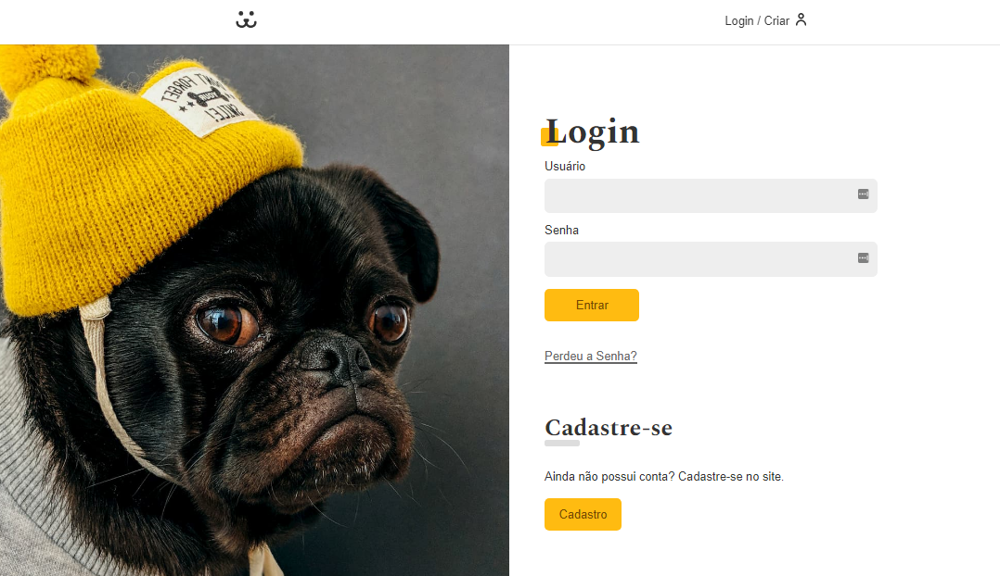

## Dogs - A Social Network for Dogs

First of all in the project directory, run:

### `npm install`

Then you run:

### `npm start`

Runs the app in the development mode.
Open [http://localhost:3000](http://localhost:3000) to view it in the browser.

To local tests you can use:
  <i> username: dog, </i>
  <i> password: dog </i>

  

